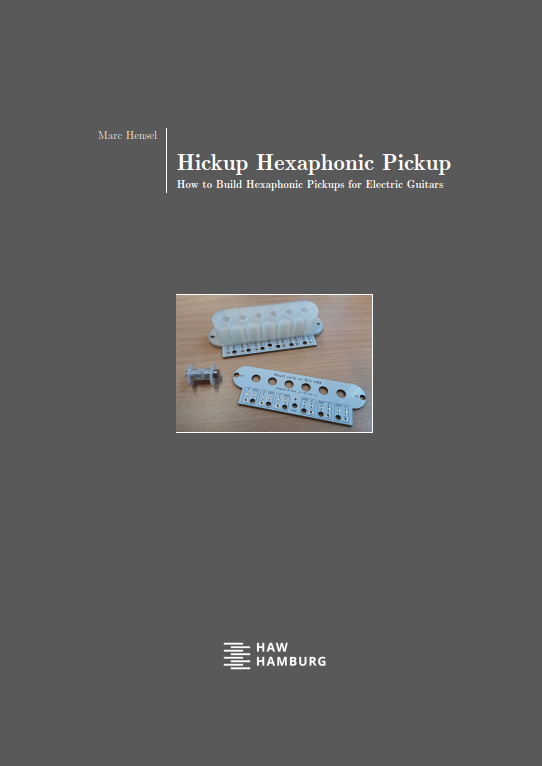

# Hexaphonic Guitar and Signal Analysis

> [!IMPORTANT]
> This respository is __work-in-progress__ of student theses. 
> It is subject to change, __not__ a reviewed publication of final results.

## What's it about?

Pickups of electric guitars typically consist of a single coil that translates oscillating movements of the strings into voltage. One electrical signal for all simultaneously played tones results. In contrast, some types of __hexaphonic pickups__ have a dedicated coil for each of the guitar's strings. Consequently, when applying pitch detection methods, one can identify which tone is played and on _which string_ it is played. Pretty cool, isn't it?

But why do we want to have a single signal for each string? Well, there are several advantages in that. Splitting the single polyphonic signal of a common pickup into six monophonic signals of a hexaphonic pickup simplifies pitch detection. So far, so boring. However, it is also the first step to automatically generate so-called tab notation while playing.

In this context, we did a first Master thesis with the objective to create a basic audio processing chain consisting of building our own hexaphonic pickup, pitch detection, and conversion into the MIDI file format. While being successful, there were too many aspects to cover, hence, the thesis could only be a proof of concept. Now comes the long and hard work of doing things "right".

Feel free to join us on this journey ... starting with the pickup. (What else?)

## Hexaphonic pickup

> [!NOTE]
> These days (October 2024) I build the next version of a largely improved pickup. 
> A detailed report on the design and production is in preparation and will follow soon.

The thesis succeeded in building a hexaphonic pickup, however, this has been extremely cumbersome and the resulting pickup was mechanically instable. Meanwhile, I have developed a significantly better design and production process based on the valuable insights we got from the first try.

Amongst others, I have improved the housing, designed a custom PCB as mechanically and electrical stable cover, and I have developed a device controlled by a Python application for winding the coils. The pickup's dimensions correspond to single coil pickup mounted at the guitar bridge. Each of the six coils hat about 2,000 windings of copper wire (0.08 mm diameter with isolation), and an electrical resistance of about 170 Ohm. I use a 7-core XLR cable, which is split into 6 standard instrument cables in a dedicated adapter box. The cables connect to an USB audio interface.

As stated above, I am already preparing a detailed report on the design as well as the production process. Material such as 3D print files and the source code of the pickup winding device are available in this repository.

## Achievements so far
- [X] _Hardware_: design of a hexaphonic pickup (including  coil winding machine, 3D prints, and PCB)
- [X] _Signal chain_: simple chain from hexaphonic guitar to signal analysis in a laptop
- [X] _Pitch detection_: proof of concept for MIDI convertion of guitar signals

This is a good foundation. Now there are lots and lots to further topics to work on in detail.

## Next steps
The next step is to finalize the pickup and connections, and to mount it in 

## Uploaded material

## Contributors
The activities done so far and hopefully still to come are collaborations of myself and my magnificent students of our [Department at HAW Hamburg](https://www.haw-hamburg.de/hochschule/technik-und-informatik/departments/informations-und-elektrotechnik/studium/studiengaenge/):

- Marc Hensel (design of hexaphonic pickup and coil winder)
- Fiona Vogel (theses: hexaphonic guitar, MIDI)

## Supporters
My deepest thanks go to [No.1 Guitar Center, Hamburg](https://www.no1-guitars.de/). Sharing the same passion for music, they did not hesitate to support our work not only by kind words, but also by an USB audio interface offering inputs to the six coils of our hexaphonic pickups. Without this valuable support, we could not have done our work as intended.

## Contact
Marc Hensel, University of Applied Sciences Hamburg (HAW Hamburg)

http://www.haw-hamburg.de/marc-hensel
